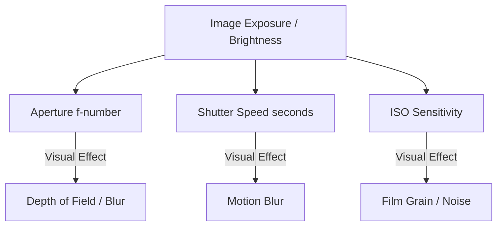

# DSLR Manual Exposure Guide & Operations Manual

Welcome to the **Manual Photography Exposure Simulator**! Operating a professional DSLR or mirrorless camera (such as the Sony A7 IV) requires balancing three core parameters to capture a correctly exposed, sharp image with the desired depth of field. 

This guide explains in detail what each setting does, how they interact, and how to read your virtual camera's LCD screen.

---

## 1. The Exposure Triangle

To get a photo with perfect brightness, you must adjust three settings that control the amount of light reaching the sensor (the exposure) and affect the visual characteristics of the picture.



---

## 2. Parameter Reference: Adjusting Your Dials

Here is exactly what happens when you increase or decrease each parameter:

### 📸 Aperture (f-number)
Aperture controls the size of the opening inside the lens diaphragm. It is measured in f-stops (e.g., f/1.4, f/4, f/22).

| Setting Direction | Dial Turn Left (Lower f-number: f/1.4, f/2) | Dial Turn Right (Higher f-number: f/16, f/22) |
| :--- | :--- | :--- |
| **Physical Opening** | **Large Opening** (wide open) | **Small Opening** (pinhole size) |
| **Light Intake** | **More light** enters the camera | **Less light** enters the camera |
| **Depth of Field** | **Shallow Depth of Field** (bokeh blur) | **Deep Depth of Field** (fully sharp) |
| **Visual Effect** | Subject is extremely sharp; background is heavily blurred (bokeh). | The entire scene (foreground trees and background mountains) remains sharp. |
| **Best Used For** | Portraits, isolating a subject from a busy background. | Landscapes, cityscapes, architectural shots. |

---

### ⏱️ Shutter Speed (seconds)
Shutter speed controls how long the camera's mechanical shutter doors stay open, exposing the sensor to light.

| Setting Direction | Dial Turn Left (Faster shutter: 1/4000s, 1/1000s) | Dial Turn Right (Slower shutter: 2s, 30s) |
| :--- | :--- | :--- |
| **Light Duration** | Exposed to light for a **fraction of a second** | Exposed to light for **seconds or minutes** |
| **Light Intake** | **Less light** enters the camera | **More light** enters the camera |
| **Motion Capture** | **Freezes motion** instantly | **Blurs motion** (creates movement trails) |
| **Visual Effect** | Fast-moving objects (like running athletes or flying birds) are frozen in place with sharp edges. | Moving objects turn into silky trails. Water flows smoothly; moving cars leave light streaks. |
| **Best Used For** | Action sports, wildlife, children, streets in daylight. | Night photography, smooth waterfall shots, light trails. |

---

### 🎛️ ISO (Sensor Sensitivity)
ISO measures the electrical amplification applied to the light captured by the camera sensor.

| Setting Direction | Dial Turn Left (Lower ISO: 100, 200) | Dial Turn Right (Higher ISO: 6400, 12800) |
| :--- | :--- | :--- |
| **Sensitivity** | **Low sensitivity** | **High sensitivity** |
| **Light Intake** | Requires **bright environment** | Amplifies faint light in **dark environments** |
| **Image Cleanliness** | **Clean, crisp picture** | **Noisy, grainy picture** |
| **Visual Effect** | The smoothest and cleanest picture with no digital static noise. | Heavy monochrome film grain (looks like photographic noise/sand texture). |
| **Best Used For** | Bright sunny landscapes, studio lighting. | Night sky, indoor cafes, dark alleyways. |

---

## 3. The Mathematics of Exposure

Your camera computes brightness using **Exposure Values (EV)**.

1. **Base EV Calculation** (based on Aperture $N$ and Shutter Speed $t$):
   $$EV = \log_2\left(\frac{N^2}{t}\right)$$
   *Smaller apertures (higher f-numbers) and faster shutter speeds increase this value (requires brighter scenes).*

2. **ISO Compensation**:
   $$\text{adjustedEV} = EV - \log_2\left(\frac{\text{ISO}}{100}\right)$$
   *Increasing the ISO lowers the required EV, making the sensor more sensitive.*

3. **Exposure Difference ($\Delta\text{EV}$)**:
   $$\Delta\text{EV} = \text{targetEV} - \text{adjustedEV}$$
   *Each scene has a natural environment brightness (Target EV).*

### 📊 Reading the HUD Indicators

```text
       UNDEREXPOSED                    MATCHED                    OVEREXPOSED
    (Image is too dark)          (Perfect brightness)         (Image is too bright)
   
     -3  -2  -1   0  +1  +2  +3     -3  -2  -1   0  +1  +2  +3     -3  -2  -1   0  +1  +2  +3
[ ]--I---|---|---|---|---|---|     ---|---|---|--I---|---|---|     ---|---|---|---|---|---I--[ ]
           Needle Left                    Needle Center                  Needle Right
          (deltaEV > 1)                   (deltaEV = 0)                  (deltaEV < -1)
```

- **Exposure Difference ($\Delta\text{EV}$)**:
  - **$\Delta\text{EV} = 0$**: Correctly exposed. The light meter needle is centered on **0**.
  - **$\Delta\text{EV} > 0$**: Underexposed. The image is too dark. The needle points to the **minus (-)** side. An on-screen **`UNDEREXPOSED`** alert flashes if $\Delta\text{EV} > 1.0$.
  - **$\Delta\text{EV} < 0$**: Overexposed. The image is too bright. The needle points to the **plus (+)** side. An on-screen **`OVEREXPOSED`** alert flashes if $\Delta\text{EV} < -1.0$.

- **Luminance Histogram**:
  - Shows the distribution of dark (shadows, left side) to bright (highlights, right side) pixels in the scene.
  - An **underexposed** photo will have the graph bunched up against the left wall (crushed shadows).
  - An **overexposed** photo will have the graph bunched up against the right wall (blown highlights).
  - A **correctly exposed** photo will have a balanced arch in the center.

---

## 4. Visual Layout & Interface States

Below are the actual screenshots of the running simulator showing each configuration state:

### 1. Camera Startup (Boot Screen)
When you load the page, the LCD screen simulates a progressive camera firmware booting sequence (takes 2.5 seconds).


### 2. Main Live Viewfinder (OSD HUD)
Once booted, the LCD turns on. In Full OSD Mode, it overlays:
- **Telemetry (Top Left)**: Live numbers for Aperture, Shutter, ISO, EVs, and difference.
- **Histogram (Top Right)**: Live 256-bin luminance distribution.
- **Light Meter (Bottom Center)**: Analog slider displaying exposure stops from -3 to +3.
- **Composition Grid**: Toggleable 3x3 Rule-of-Thirds layout.
- **Exposure Warning**: Displays flashing `UNDEREXPOSED` or `OVEREXPOSED` if settings are mismatched.


### 3. Camera Menu (Settings & Library)
Clicking the mechanical **MENU** button (or pressing **M**) opens the menu pane on the LCD screen, allowing you to select scenes, manage saved profiles, or upload images.


### 4. Photo Playback (Before / After Comparison)
Clicking the **PLAY** button (or pressing **P**) opens the playback deck. Here, you can review saved snapshots side-by-side with the original un-processed scene, alongside the full metadata capture table.


### 5. Educational Challenge Mode
Accessed through the Menu, this mini-game issues randomized target exposure values. Adjust the controls to balance the triangle; getting within tolerance awards you with 1 to 3 gold stars!


---

## 5. Operations Walkthrough

Here is how to operate the camera simulator step-by-step:

### 1. Switching Scenes
Open the **MENU (M)**, go to **Scene Library**, and select a scene.
- *Night City* is dark (Target EV: 6) $\rightarrow$ Requires slow shutter speeds and high ISO values.
- *Landscape* is bright (Target EV: 14) $\rightarrow$ Requires fast shutter speeds and low ISO to prevent clipping.

### 2. Selecting Dials & Adjusting Parameters
- Click the parameter labels (**APERTURE**, **SHUTTER**, or **ISO**) above the dial, or click the **SET** button in the center of the control wheel to toggle your focus.
- Rotate the wheel by placing your cursor over it and **scrolling your mouse wheel**, or **click and drag** in a circular motion.
- You can also use the **Left Arrow** and **Right Arrow** keys.
- Notice that when switching focus, the dial visually rotates and animates back to its stored position index.

### 3. Snapping a Photo
Once your light meter needle sits near **0** and no exposure warnings flash, click the **SHUTTER / CAPTURE** button (or press **C**). The screen flashes white to confirm the capture. Open the Playback screen (P) to review your captures!
