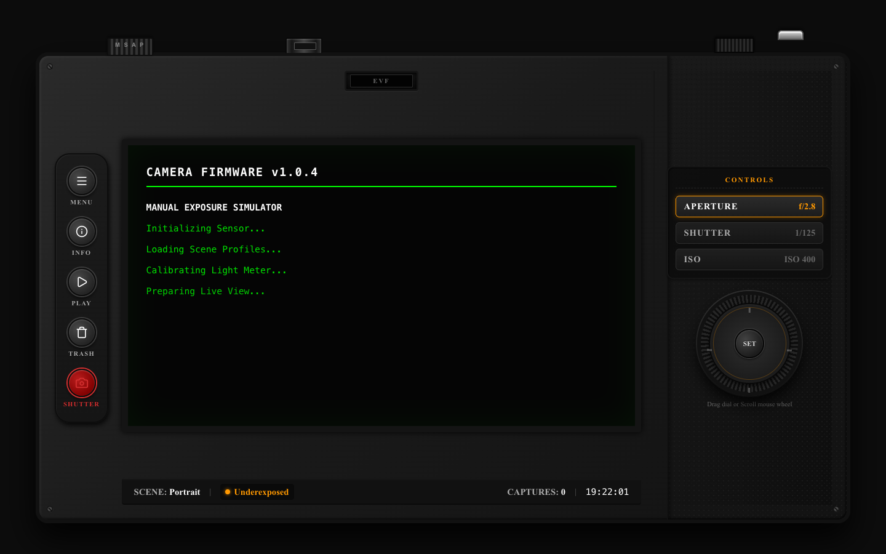
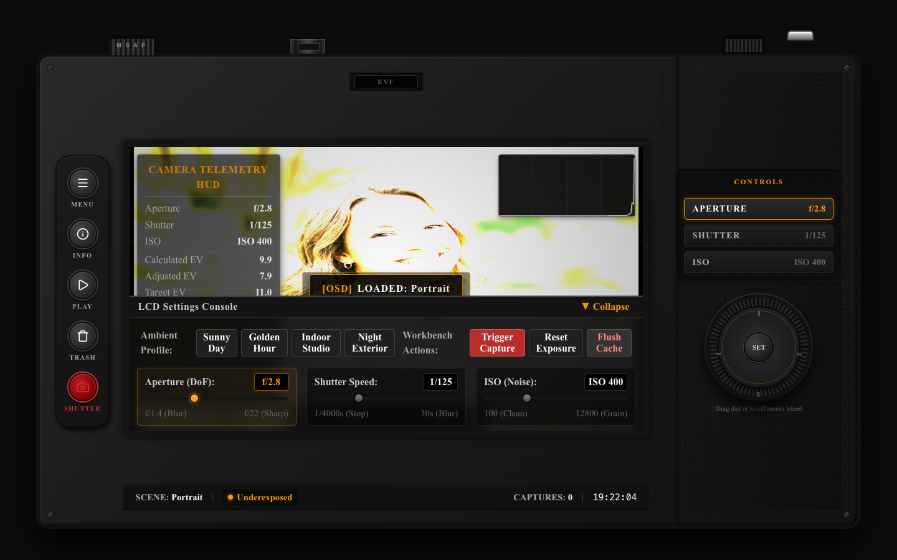
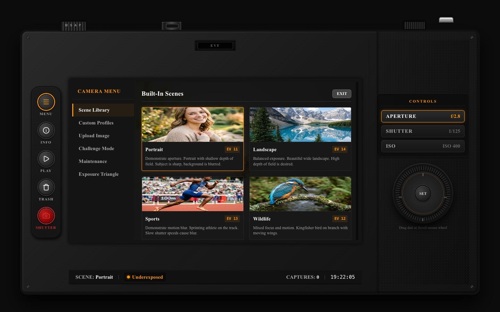
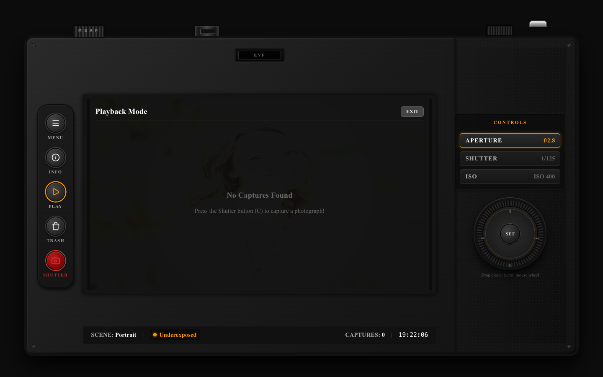
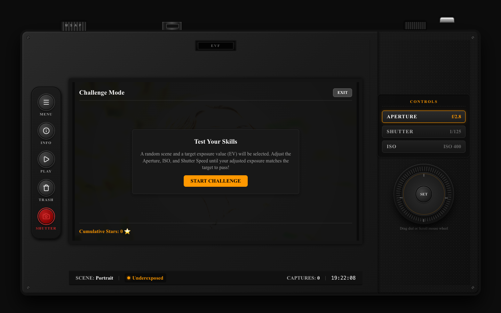

# Manual Photography Camera Exposure Simulator

An optical-engineering and digital-imaging simulation web application built using **React**, **TypeScript**, **Vite**, **Zustand**, **Canvas API**, and **CSS Modules**.

### 🌐 Live Production Demo: [react-project-cyan-iota.vercel.app](https://react-project-cyan-iota.vercel.app)
*(Alternative: [react-project-57ou8dhj7-danish1323s-projects.vercel.app](https://react-project-57ou8dhj7-danish1323s-projects.vercel.app))* 

This simulator replicates the rear interface of a professional DSLR mirrorless camera (inspired by the **Sony A7 IV** chassis layout) and dynamically models the physics of the **Exposure Triangle** (Aperture, Shutter Speed, ISO) on real-world photograph assets at 60 FPS.

---

## 📸 Interface Screenshots

### 1. Boot Sequence BIOS Loader
When the camera starts, it triggers a 2.5-second progressive bios calibration terminal loader, initializing sensor arrays and validating light-meter sweeps before transitioning to live-view.


### 2. Main DSLR Viewfinder HUD & Collapsible Console
The LCD viewport renders the scene in real time, overlaid with exposure diagnostics, Rule-of-Thirds grid lines, and live luminance histogram. The **LCD Settings Console** at the bottom hosts environmental light profiles and sliding targeted rails.


### 3. Quick-Settings Overlay Menu
Clicking the MENU button (or pressing `M`) opens the camera menu screen, letting users configure photograph scene selections, upload custom image assets, save named camera profiles, or inspect exposure tutorials.


### 4. Photo Playback & Comparison View
Pressing the PLAY button (or pressing `P`) loads captured snapshots from the local gallery database. It displays a side-by-side comparison of the original scene and the captured settings, complete with a flat EXIF telemetry table.


### 5. Challenge Mode Mini-game
An educational challenge game that selects a random scene and target EV level. The user must manually tune the aperture, shutter, and ISO to balance the exposure. Stars are awarded based on proximity to the target EV.


---

## 🔬 Camera Physics & Mathematical Formulas

The exposure engine simulates light sensitivity using base-2 logarithmic systems standard in photography:

### 1. Calculated Exposure Value (EV)
Exposure Value is derived from the physical lens aperture (f-number, $N$) and the exposure duration in seconds (shutter speed, $t$):
$$EV = \log_2\left(\frac{N^2}{t}\right)$$

### 2. ISO Sensitivity Compensation
Standard EV calculations assume an ISO rating of 100. For higher sensitivities, the simulator calculates the compensated exposure offset:
$$\text{adjustedEV} = EV - \log_2\left(\frac{\text{ISO}}{100}\right)$$

### 3. Exposure Difference ($\Delta$ EV)
The mathematical difference between the ambient scene's light level ($\text{targetEV}$) and the camera's sensitivity settings determines the exposure balance:
$$\Delta EV = \text{targetEV} - \text{adjustedEV}$$
*   **$\Delta EV > 1.0$ (Overexposed):** The camera lets in too much light. The image renders brighter, the light-meter needle slides to the right ($+$), and an `OVEREXPOSED` warning flashes.
*   **$\Delta EV < -1.0$ (Underexposed):** The camera lets in too little light. The image renders darker (pitch black at extremes), the needle slides to the left ($-$), and an `UNDEREXPOSED` warning flashes.
*   **$-1.0 \le \Delta EV \le 1.0$ (Correctly Exposed):** The exposure is balanced.

---

## ⚙️ Canvas Rendering Engine Pipeline

Image processing runs locally in the browser using the HTML5 Canvas API. The rendering pipeline operates as a virtual camera sensor:

```text
Original Scene Image
         ↓
Sensor Exposure Processing (Brightness scaling by multiplier 2^ΔEV)
         ↓
Depth Of Field Blurring (Aperture-dependent radial focus mask blending)
         ↓
Motion Blur Simulation (Shutter-dependent multi-draw offset directional blur)
         ↓
ISO Sensor Noise Generation (Procedural monochrome film grain turbulence)
         ↓
Real-time Luminance Analysis (Luminance histogram calculation: 0.2126R + 0.7152G + 0.0722B)
         ↓
Display Canvas Output (scaled to fit LCD screen viewport bezel)
```

### 1. Depth of Field Blurring
Aperture sizes map directly to blur radii (e.g. $f/1.4$ is a strong 16px blur; $f/22$ is sharp 0px blur). The engine blends a blurred offscreen canvas with a sharp canvas using a scene-specific grayscale mask:
$$\text{finalPixel} = \text{sharpPixel} \times (1 - \text{maskVal}) + \text{blurredPixel} \times \text{maskVal}$$

### 2. Motion Blur Streaking
Shutter speeds dictate directional motion streaks. The engine performs multi-draw image stamps shifted slightly along the motion vector of the scene (horizontal for street, diagonal for wildlife).

### 3. Stochastic ISO Grain
High ISO values trigger procedural monochrome digital noise. For each pixel, a grain factor is generated and applied uniformly across R, G, and B channels:
$$\text{grain} = (\text{Math.random()} - 0.5) \times 255 \times \text{strength}$$

---

## 🏛️ Component Architecture (Case Study Compliant)

The application structures UI concern isolation in conformity with the case study specifications:

*   **`<CameraStage />`**: The centerpiece layout block that partitions the center DSLR column between visual rendering surfaces and configuration decks.
*   **`<LiveViewFinderCanvas />`**: Manages the `<canvas>` drawing context, Rule-of-Thirds grid overlays, shutter capture flashes, and overlay warnings.
*   **`<LightMeterScaleDisplay />`**: Renders the electronic graduated EV balance needle scale.
*   **`<CameraTelemetryHUD />`**: OSD telemetry strip displaying EV calculations, Narrow/Wide Depth of Field classification, exact offscreen rendering latency in milliseconds, and the Sensor Noise coefficient. Includes a button to download settings as a flat `.json` blueprint.
*   **`<CameraConsole />`**: Control deck grouping the parameter sliders and ambient actions:
    *   **`<EnvironmentActionStrip />`**: alters environmental profiles (**Sunny Day**, **Golden Hour**, **Indoor Studio**, **Night Exterior**) and executes **Trigger Capture**, **Reset Exposure**, and **Flush Cache** triggers.
    *   **`<ExposureTriangleForm />`**: range sliders (targeted selection rails) to adjust Aperture, Shutter, and ISO parameters.

---

## 🗄️ Zustand State Stores

State management is decoupled into five isolated Zustand stores:
1.  `cameraStore`: Manages Aperture, Shutter, ISO, calculated EV values, rendering latency, and remembers separate wheel dial angles.
2.  `sceneStore`: Handles active photographic backgrounds, radial custom upload masks, and custom file uploads.
3.  `uiStore`: Tracks active menu overlays, playback states, challenge panel visibility, OSD info mode, and triggers shutter sweeps.
4.  `galleryStore`: Saves captured PNG files and metadata lists directly inside browser storage.
5.  `challengeStore`: Selects target EVs and scores manual exposures using star ratings.

---

## 🚀 Setup & Installation Instructions

Ensure you have [Node.js](https://nodejs.org/) installed, then follow these steps:

### 1. Install Dependencies
```bash
npm install
```

### 2. Run the Development Server
```bash
npm run dev
```
Open [http://localhost:5173/](http://localhost:5173/) in your desktop browser.

### 3. Production Compilation
Verify type correctness and build optimized assets using:
```bash
npm run build
```
